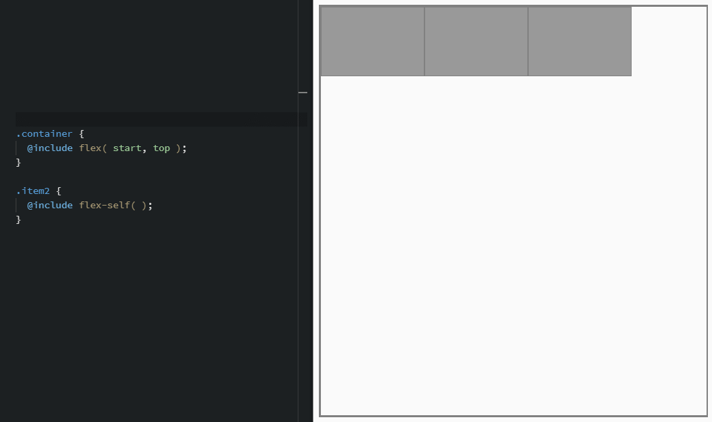
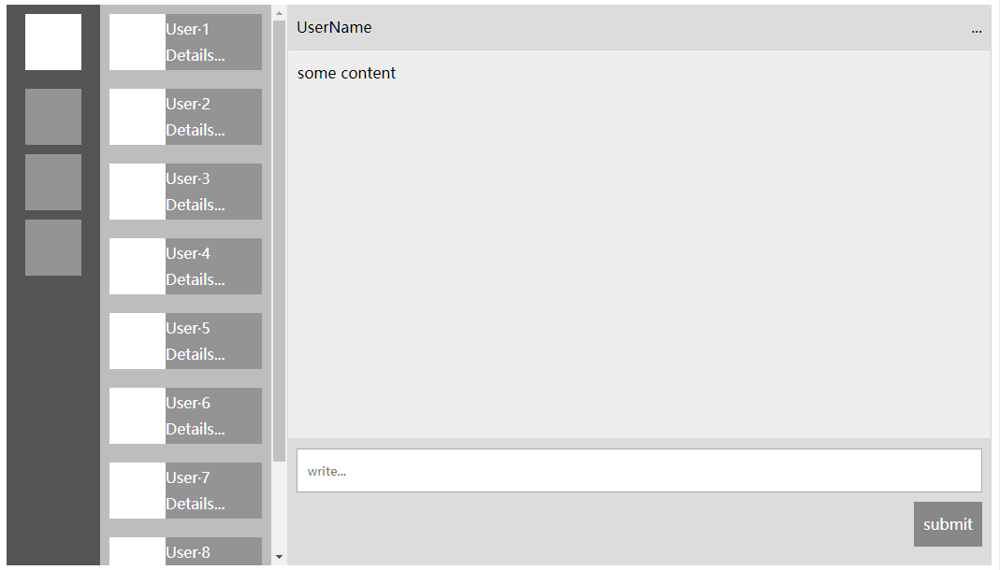

# scss-flex

> 用于 Flex 布局模块的 scss 混合宏。

## Installation

### npm

```bash
$ npm i @nn-yy/scss-flex --save-dev
```

将仓库克隆或下载到本地。

## Usage

在 scss 中导入 scss-flex.scss 文件。

```scss
@import 'scss-flex';
```

在 webpack 中使用 '~' 前缀将路径指向 node_modules。

```scss
@import '~@nn-yy/scss-flex';
```

## Example

### Base layout



### Complex layout



see [demo](https://codepen.io/wizard67/full/VdPPyQ/)

## Feature

* 简单易用的函数方法
* 参数错误提示

## Document

### Schematic

```bash
  ┌── start ───┬── center ──┬──── end ───┐
 top           │            │            │
  ├────────────┼────────────┼────────────┤
middle         │    ████    │            │
  ├────────────┼────────────┼────────────┤
bottom         │            │            │
  └────────────┴────────────┴────────────┘

<justify>: start | center | end
  <align>:   top | middle | bottom


between ├███ ────────── ███ ────────── ███┤

around  ├── ███ ─────── ███ ─────── ███ ──┤

<space>: between | around


keep    ├███ ███ ███ ─────────────────────┤
full    ├█╠╠╠╠╠╠╠╠╠╠███╣╣╣╣╣╣╣╣╣╣█ ███ ███┤

<flex>: auto | keep | full
```

### API

scss-flex 为容器内容 `横排序(row)` 和 `纵(column)排序` 各提供了 3 个方法：

#### flex( row: start, column: top )

> 声明横排序的 Flex 容器，`row` 为水平方向参数，`column` 为垂直方向参数。

* row：`<justify> | <space>`
    * `start` 居左
    * `center` 水平居中
    * `end` 居右
    * `between` 两端对齐
    * `around` 等距分布

* column：`<align>`
    * `top` 居顶部
    * `middle` 垂直居中
    * `bottom` 居底部

#### flex-wrap( column: top )

> 允许容器内容换行，`column` 为多行时轴线的垂直方向参数。

* column：`auto | <align> | <space>`
    * `auto` 默认分布
    * `top` 居顶部
    * `middle` 垂直居中
    * `bottom` 居底部
    * `between` 两端对齐
    * `around` 等距分布


#### flex-self( flex , column: auto )

> 定义横排序中项目自身的位置与尺寸。`flex` 为项目的尺寸缩放参数，`column` 为项目在垂直方向参数。

* flex: `<flex>`
    * `auto` 默认分布
    * `full` 填充水平轴上剩余空间
    * `keep` 保持原有尺寸，不受缩放影响
* column: `auto | full | <align>`
    * `auto` 默认分布
    * `top` 居上
    * `middle` 居中
    * `bottom` 局底部
    * `full` 填充垂直轴上剩余空间


#### flex-column( row: start, column: top )

> 声明纵排序的 Flex 容器，`row` 为水平方向参数，`column` 为垂直方向参数。

* row：`<justify>`
    * `start` 居左
    * `center` 水平居中
    * `end` 居右
* column：`<align> | <space>`
    * `top` 居顶部
    * `middle` 垂直居中
    * `bottom` 居底部
    * `between` 两端对齐
    * `around` 等距分布

#### flex-column-wrap( column: start )

> 允许容器内容换列，`column` 为多列时轴线的水平方向参数。

* column：`auto | <justify> | <space>`
    * `auto` 默认分布
    * `start` 居左
    * `center` 水平居中
    * `end` 居右
    * `between` 两端对齐
    * `around` 等距分布

#### flex-colunm-self( flex , row: auto )

> 定义纵排序中项目自身的位置与尺寸。`flex` 为项目的尺寸缩放参数，`row` 为项目在水平方向参数。

* flex: `<flex>`
    * `auto` 默认分布
    * `full` 填充垂直轴上剩余空间
    * `keep` 保持原有尺寸，不受缩放影响
* row: `auto | full | <align>`
    * `auto` 默认分布
    * `start` 居上
    * `center` 居中
    * `end` 局底部
    * `full` 填充水平轴上剩余空间

## Comptibility

项目仅提供标准的 [Flexible Box Layout Module](https://www.w3.org/TR/css-flexbox-1/) 语法，如果需要兼容老版本的语法，需要使用 [autoprefixer](https://github.com/postcss/autoprefixer) 在生产环境中添加兼容前缀。


## Log

* 0.3.1 为 `flex` 与 `flex-column` 提供缺省参数
