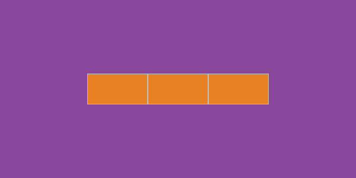

# scss-flex

> 用于 Flex 布局模块的 scss 混合宏。

## 安装

使用 npm 安装。

```bash
$ npm install @nn-yy/scss-flex --save-dev
```

将仓库克隆或下载到本地。

## 使用

在 scss 中导入 scss-flex.scss 文件。

```scss
@import 'scss-flex';
```
  
使用 webpack 时需要添加 '~' 前缀将路径指向 node_modules。

```scss
@import '~@nn-yy/scss-flex';
```

### 容器内容水平垂直居中：

```scss
.container {
  @include flex( center, middle );
}
```



### 容器内容两端对齐并居于底部，指定的项目垂直居中：

```scss
.container {
    @include flex( between, bottom );
}
.item:nth-child(2) {
    @include flex-self( middle );
}
```


### 容器内容两端对齐并垂直居中，允许项目自动换行并使轴线与交叉轴中点对齐：

```scss
.container {
    @include flex(between, bottom);
    @include flex-wrap( middle );
}
```


### 容器内容按列排序，水平居中垂直于底部，指定的项目填充轴线空间：

```scss
.container {
    @include flex-column( center, bottom );
}
.item:nth-child(2) {
    @include flex-column-self( full );
}
```


## API


> `<justify>: start | center | end`  
> `<align>: top | middle | bottom`  
> `<space>: between | around`  
> `<flex>: auto | none`

scss-flex 为容器内容行（'row'）排列和列（'column'）排列各提供了 3 个方法：

`flex( <justify> | <space>, <align> )`

声明 Flex 容器，默认为行（`row`）排列。首个参数指定主轴上的空间分布状况，第二个参数指定交叉轴上的空间分布状况。

`flex-wrap( auto | <align> | <space> )`

允许容器内的项目空间分配不足时自动换行（产生新的交叉轴），参数指定了存在多条交叉轴时，这些轴线的空间分布情况。

`flex-self( auto | full | <align> [, <flex>])`

指定单个项目的空间分布状况（声明在项目上）。首个参数声明项目的空间分布于分配情况，第二个可选参数声明项目缩放比例。

`flex-column( <justify>, <align> | <space> )`

声明列（'column'）排列的 Flex 容器。

`flex-column-wrap( auto | <justify> | <space> )`

允许列排序时自动换行。

`flex-column-self( auto | full | <justify> [, flex])`

指定列排序时的单个项目的空间分布情况。
